# 🚀 Real-Time Crypto Exchange Pipeline

> End-to-end ⚡ streaming data pipeline using modern open-source tools: **Kafka**, **Flink**, **ClickHouse**, **Grafana**, **Airflow**, and **Docker** 🐳

---

## 🌟 Overview

Ingest live crypto and fiat prices from public APIs and stream them through a fully automated real-time ETL pipeline.

🎯 **Goal**: Real-time currency conversion + fast analytics + stunning dashboards.

---

## 🧱 Architecture

> From ingestion to visualization — fully containerized

🔹 **CoinGecko API** 🛰️ →\
🔹 **Airflow** ⚙️ once at project start to set up 𝐊𝐚𝐟𝐤𝐚 𝐂𝐨𝐧𝐧𝐞𝐜𝐭 and run 𝐅𝐥𝐢𝐧𝐤 SQL scripts. →\
🔹 **Kafka** topics (`crypto_prices`, `fiat_exchange_rates`) 🔄 →\
🔹 **Flink SQL** 💡 joins & converts data →\
🔹 **ClickHouse** 🏪 stores results →\
🔹 **Grafana** 📊 visualizes everything in real-time

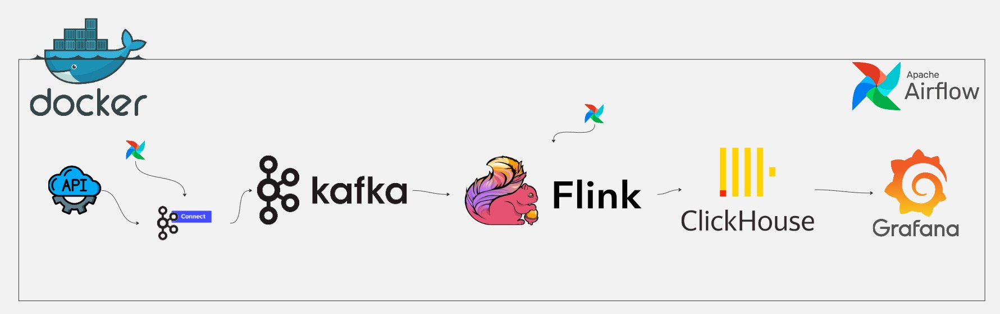

---

## 🧬 Stream Modeling

> Currency conversion modeled in Flink SQL

- 💱 Real-time **joins** between crypto & fiat streams
- 🧮 Calculations: BTC/ETH →  USD, EUR, ...

---

## 📊 Grafana Dashboard

> Track exchange rate trends & live values


### Insights:

- 🔄 Real-time BTC/ETH conversion
- 📈 Trends every 5 min
- 🌍 Prices in USD, EUR

---

## 🔄 ETL Flow (Step-by-Step)

1. **Ingest** data using Kafka Connect every 10 seconds ⏱️
2. **Airflow DAG**: `create_kafka_connectors`
3. **Flink job** performs join & conversion 💱
4. **Airflow DAG**: `create_clickhouse_and_run_flink`
5. **ClickHouse** stores final values 🏪
6. **Grafana** displays real-time charts 📊

---

## 🛠️ Tech Stack

| Tool              | Role                           |
| ----------------- | ------------------------------ |
| 🐳 Docker Compose | Container orchestration        |
| 🌐 CoinGecko API  | Live crypto/fiat data          |
| 🧩 Kafka          | Stream transport layer         |
| ⚡ Flink SQL       | Stream processing (ETL logic)  |
| 🏪 ClickHouse     | Fast OLAP DB for analytics     |
| 📊 Grafana        | Dashboards & real-time visuals |
| 🌀 Airflow        | Workflow orchestration (DAGs)  |

---
## 🌐 CoinGecko API
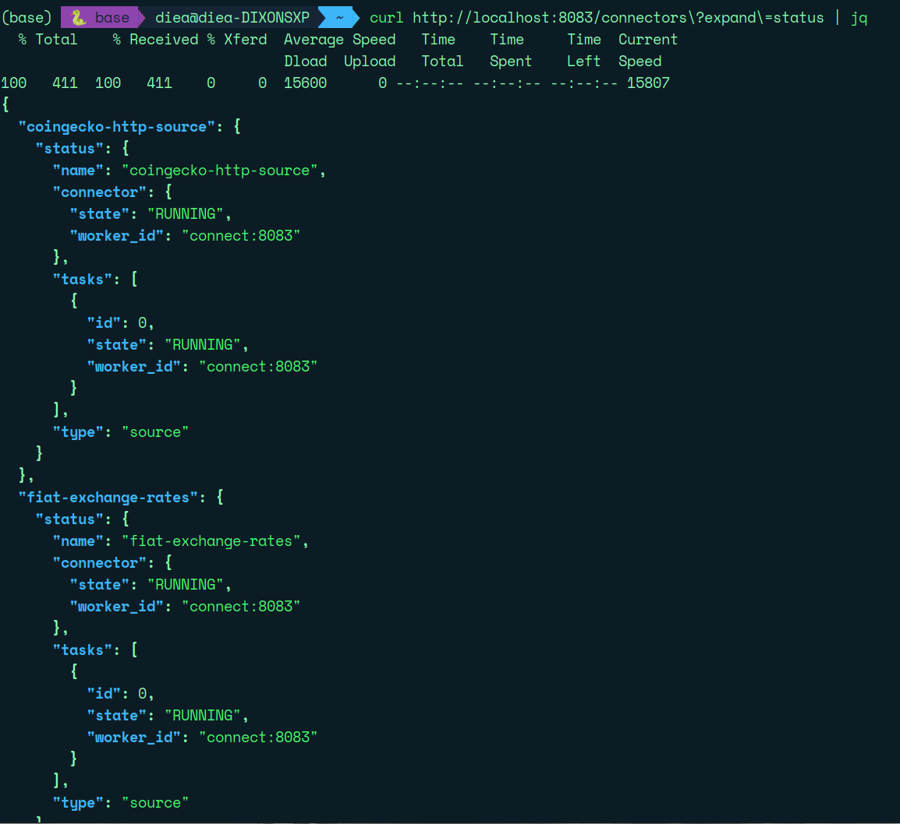

---
## 🧩 Kafka
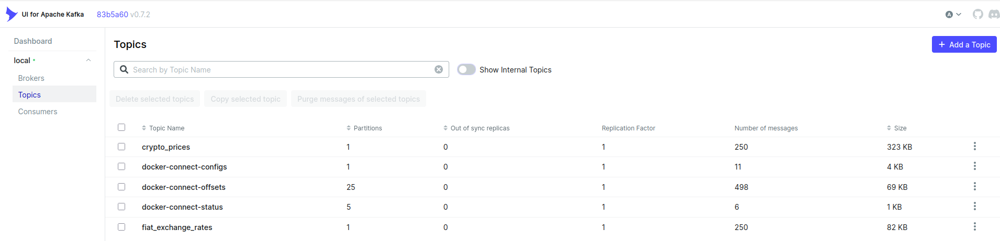

---
## ⚡ Flink
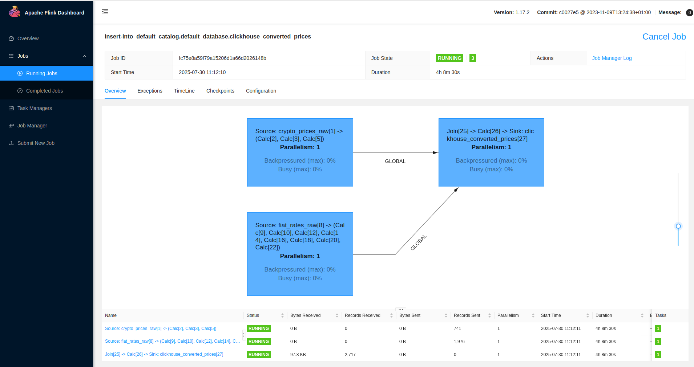

---
## ⚡ Airflow
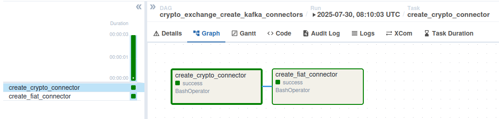
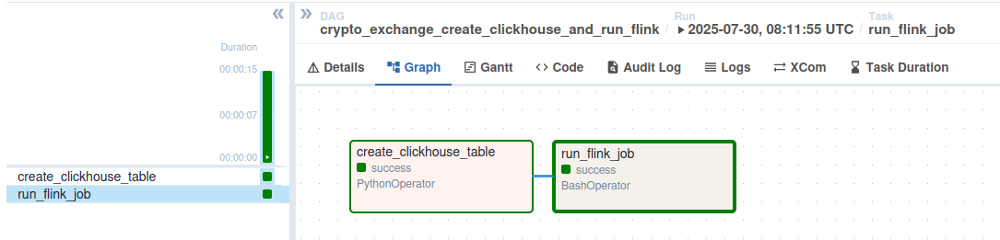

---

## 📁 Project Structure

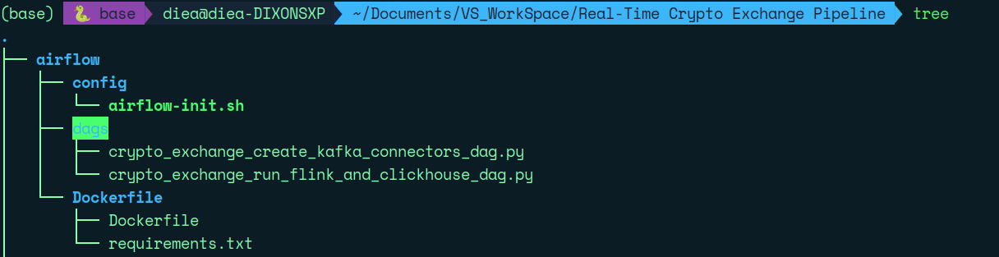
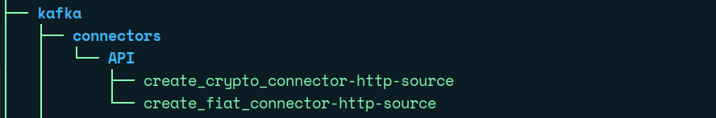
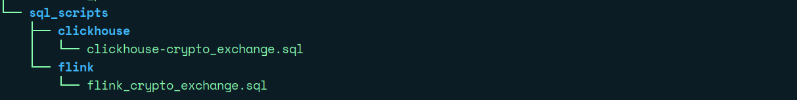

---
## 📊 Grafana

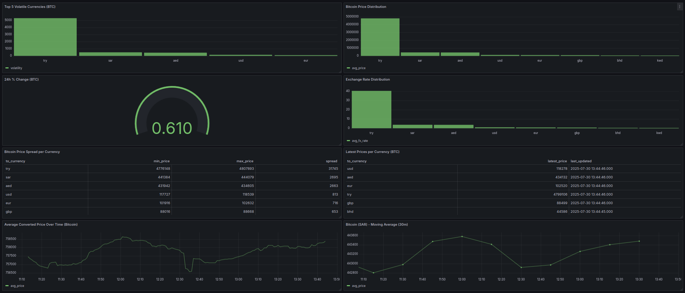
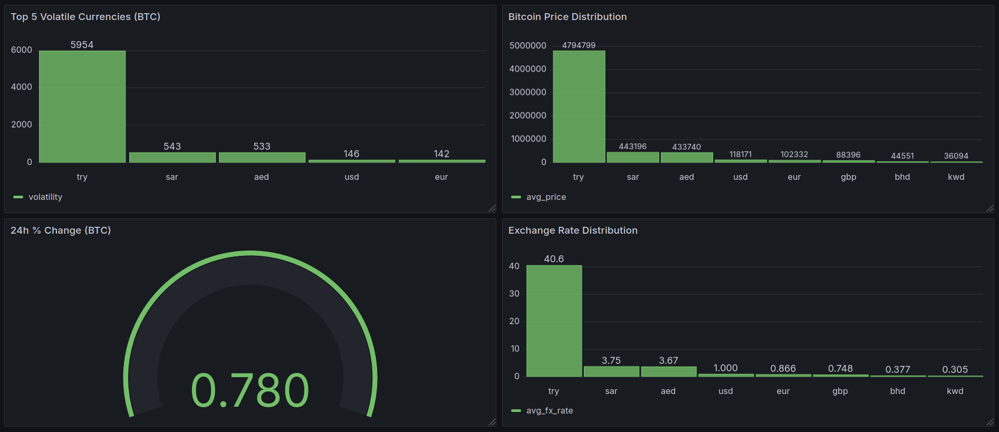
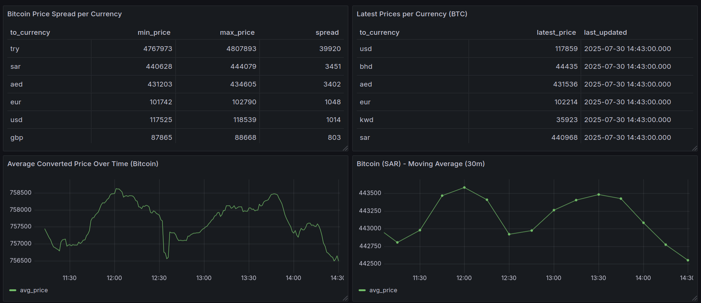

---

## 🚀 How to Run It Locally

> Requires: **Docker & Docker Compose**

```bash
# Start the full platform
docker compose up -d

# Airflow UI:
http://localhost:8084

# Kafka UI:
http://localhost:8090

# Flink SQL:
http://localhost:8082

# Grafana:
http://localhost:3001
```

---

## 🙏 Credits

- 📡 Data: [CoinGecko API](https://www.coingecko.com/en/api)
- 🛠️ Tools: Kafka, Flink, ClickHouse, Grafana, Airflow
---

> Created with 💡 by Diea — Fueled by ☕, Curiosity & Real-Time Data Streams 🌍⚡

